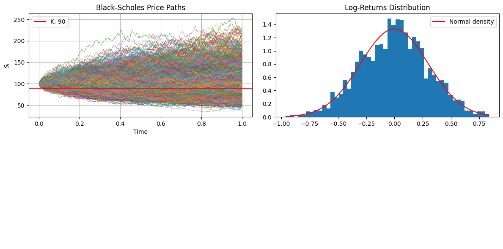
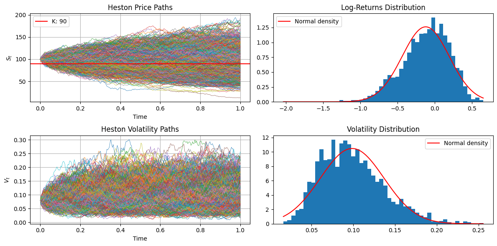
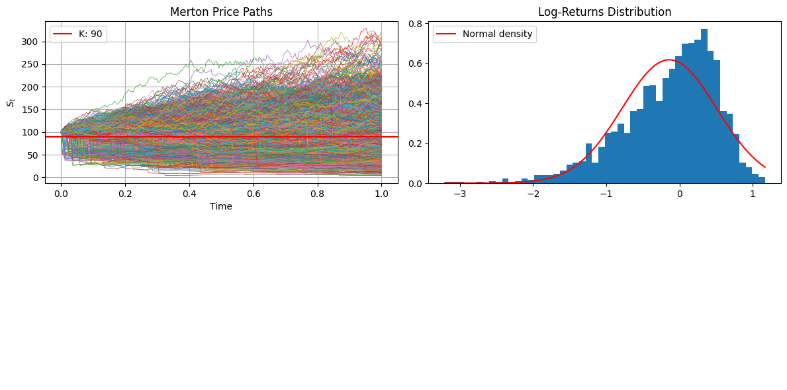
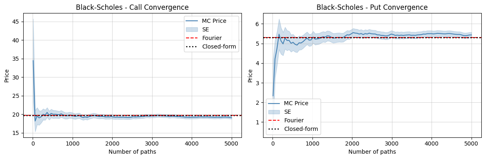
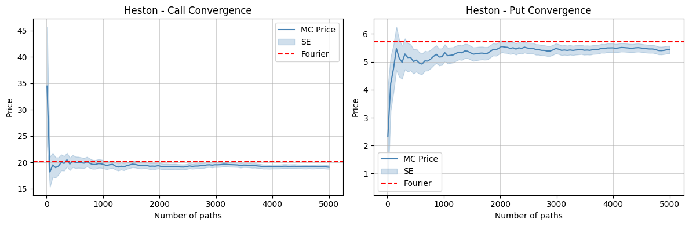
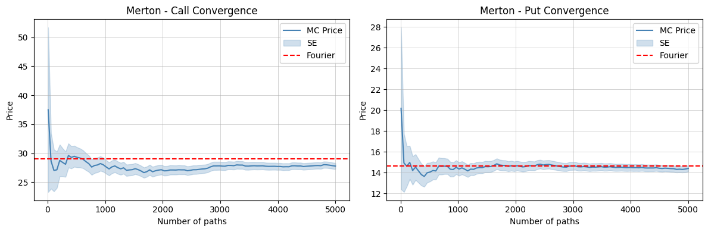

# Advanced Equity Derivatives Pricing & Calibration
_______


A modular Python framework for option pricing, volatility surface analysis, Monte Carlo simulation, and model calibration using:
* Black–Scholes (closed-form + Fourier inversion)
* Heston stochastic volatility model
* Merton jump diffusion model
* Monte Carlo simulation engines
* Volatility surface construction from market data (via Yahoo Finance)


```
module/
├── pricer.py          # Pricing engines (BS, Heston, Merton, MC, Asian options)
├── modelpaths.py      # Path simulation (BS, Heston, Merton)
├── utils.py           # Data loading + calibration routines
├── viz.py            # Visualization utilities (surface, smiles, diagnostics)
```


### Market Data Pipeline

* Pulls option chains using yfinance
* Filters noisy market quotes
* Builds clean dataset for calibration
* Constructs volatility surfaces across maturities


### Pricing Models

* Black–Scholes closed-form pricing
* Fourier-based pricing for:
    * Black–Scholes
    * Heston stochastic volatility
    * Merton jump diffusion
* Monte Carlo pricing (vanilla + Asian options)


<br>


## Distributions of Model

-------------


### Black–Scholes: Lognormal symmetry + thin tails

Under Black–Scholes, asset prices follow a geometric Brownian motion (GBM) $\implies$ log-returns are normally distributed and $S_T$ is lognormally distributed.

As a result, simulated terminal prices exhibit:
* A single-peaked, smooth distribution
* Light tails 
* A relatively narrow dispersion around the mean
* Strong symmetry in log-space (no skew beyond drift effects)

This leads to a model where extreme price moves are inherently underrepresented:
- this makes the distribution mathematically tractable
- but limits its ability to reflect observed market phenomena such as volatility clustering or crash risk


<div style="display: flex; justify-content: space-between;">
  <div style="width: 100%;">
    
  </div>
</div>


### Heston: Heavy-tailed distribution from stochastic volatility


Heston model introduces stochastic volatility, which transforms the distribution of $S_T$ into a conditional lognormals. Since volatility itself evolves randomly and mean-reverts, the resulting distribution is notably richer.

* Fat tails relative to Black–Scholes
* More pronounced skewness  
* A wider spread of outcomes, reflecting volatility uncertainty
* Occasional clustering of paths leading to extreme terminal values

This mixture structure produces a distribution that is no longer purely lognormal:
- behaves like a weighted aggregation of lognormals with varying variances
- this is a more realistic representation of market uncertainty, especially in stress scenarios


<div style="display: flex; justify-content: space-between;">
  <div style="width: 100%;">
    
  </div>
</div>


### Merton: Discontinuous jumps + asymmetric fat tails


Merton jump-diffusion model introduces Poisson-distributed jumps, which fundamentally alter the geometry of $S_T$  distribution. 
- Unlike Heston, where fat tails emerge smoothly from stochastic variance
- Merton generates fat tails through discrete shocks

Empirical characteristics include:
* Strong asymmetry in the distribution
* Pronounced heavy tails on both sides, depending on jump parameters
* Visible secondary mass in the histogram due to jump events
* Higher probability of extreme downward moves when jump mean is negative

This produces a distribution that is more granular in structure: 
- instead of smooth tail thickening, extreme outcomes emerge from rare but significant jumps
- this makes the model particularly effective for capturing crash risk and event-driven price dynamics


<div style="display: flex; justify-content: space-between;">
  <div style="width: 100%;">
    
  </div>
</div>


<br> <br>


## Key Findings

--------------


### 1. Black–Scholes is systematically mispricing volatility smiles


Across all tested equities, the Black–Scholes framework produces a flat volatility assumption, which fails to reproduce the observed market smile.
* Out-of-the-money options are consistently mispriced.
* Implied volatility exhibits a clear U-shape across strikes.
* The mispricing grows with maturity for illiquid strikes.


### 2. Stochastic volatility (Heston) significantly improves fit

The Heston model reduces pricing errors materially compared to Black–Scholes.

* Captures volatility skew (leverage effect) via negative correlation parameter $\rho$
* Produces realistic term-structure of volatility
* Calibration consistently converges to:
    * Negative $\rho$ (equity-like behavior)
    * Moderate mean reversion $\kappa$
    * Low long-run variance $\theta$


### 3. Jump diffusion is essential for short-dated wings

The Merton model shows its strength in short-maturity options, especially deep OTM contracts.

* Improves fit in the tails where diffusion models fail
* Captures sudden discontinuous price movements
* Jump intensity $\lambda$ increases for high-volatility regimes


### 4. Monte Carlo convergence confirms Fourier accuracy

Monte Carlo:
* Converges toward Fourier prices as $N \to \infty$
* Variance decreases as expected at rate $O(1/\sqrt{N})$
* Fourier prices act as stable benchmarks for validation

<div style="display: flex; justify-content: space-between;">
  <div style="width: 33%;">
    
  </div>  
  <div style="width: 33%;">
    
  </div>
  <div style="width: 33%;">
    
  </div>
</div>


<br>

